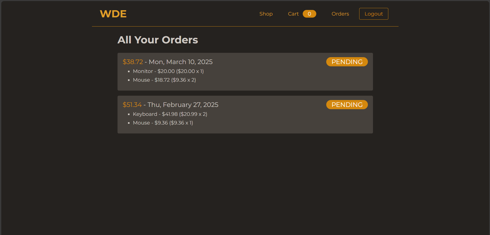

# Complete Online Shop Project

## Details
This project is the second milestone project for the 100 days of Code Udemy course. The backend is built on MongoDB.
There are two authorized roles - Admin and Customers - and have to login to access the websites full feattures(if no account exists then the user can create an account. Admins are added via the database.
This shop allows the admin to add/delete products and manage orders that have come through. Admins can give a product a name, image, description, price, and a summary.
Customers can view the products and view the details of the product. Then the product can be added to the cart and can proceed to payment. After the payment is sorted then the order is placed.
The payment processor is Stripe.
> [!IMPORTANT]  
> The payment processor - Stripe - is set up in test mode therefor no actual money can be exchanged.

## Screenshots:
### Admin
<table>
  <tr>
    <th>Page Name</th>
    <th>Screenshot</th>
  </tr>
  <tr>
    <td><strong>Admin - All Products</strong></td>
    <td></td>
  </tr>
   <tr>
    <td><strong>Admin - Add Product</strong></td>
    <td></td>
  </tr>
  <tr>
    <td><strong>Admin - Manage Orders</strong></td>
    <td></td>
  </tr>
</table>
### Customer
<table>
  <tr>
    <th>Page Name</th>
    <th>Screenshot</th>
  </tr>
  <tr>
    <td><strong>Login</strong></td>
    <td></td>
  </tr>
   <tr>
    <td><strong>Register</strong></td>
    <td></td>
  </tr>
  <tr>
    <td><strong>All Products</strong></td>
    <td></td>
  </tr>
  <tr>
    <td><strong>Product Details</strong></td>
    <td></td>
  </tr>
   <tr>
    <td><strong>Cart</strong></td>
    <td></td>
  </tr>
   <tr>
    <td><strong>Orders</strong></td>
    <td></td>
  </tr>
   <tr>
    <td><strong>Product Details</strong></td>
    <td></td>
  </tr>
 
</table>
